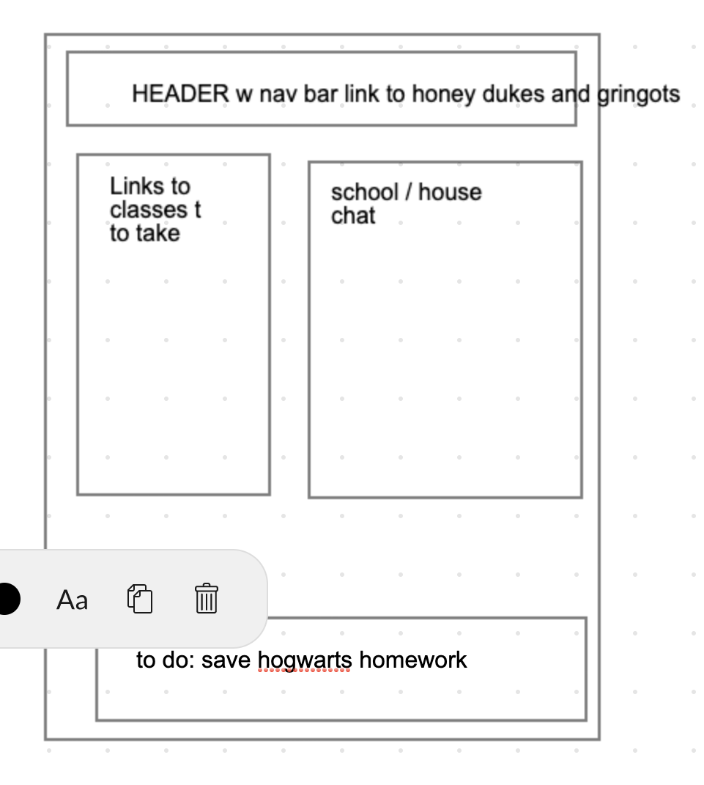

## Project Name : git-sirius

### Author: Sian , Randee and Henok.

### Links and Resources
- [submission PR]()
- [heroku]()
- [netlify]()

### DOCUMENTATION
[Swagger Hub]()
[npm publish]()

### Setup

#### `.env` requirements (where applicable)
- `PORT` - json-server --watch ./data/db || atlas

#### How to initialize/run your application (where applicable)
- nodemon to restart the server.
- Once it's restart enter localhost on the browser .
- all roles have there on capabilities, by knowing the right route . you can access the right role and capabilities .

#### Tests
- unit tests: 'npm test'
- lint test: 'npm run lint'
- nodemon: server refresh

#### UML

#### WireFrame
